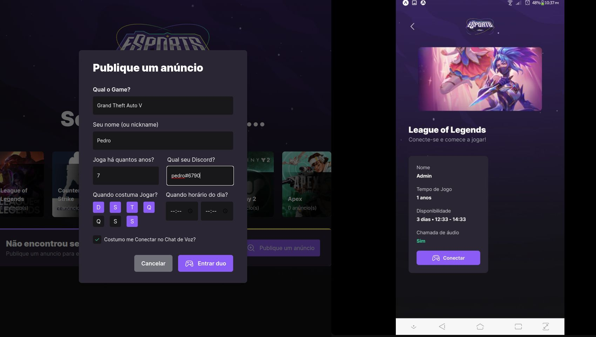

<h1 align="center">NLW Explorer  </h1>

<h3 align="center">
    🔗 HTML 🔗 CSS 🔗 HTTML  🔗 TAILWIND  🔗 REACT  🔗 NODEJS  🔗 REACT NATIVE 
</h3>

<h3 align="center">
    🔗 Create page styled with taildwind and app mobile with react native 
</h3>

🚀 Page for course

<h4 align="center"> 
	🚧 NLW IGINITE 18 9 2022 🚀 Done...  🚧
	Acess link: ...
</h4>

<h2 align="center"> ### Exemple Page  </h2>

  

